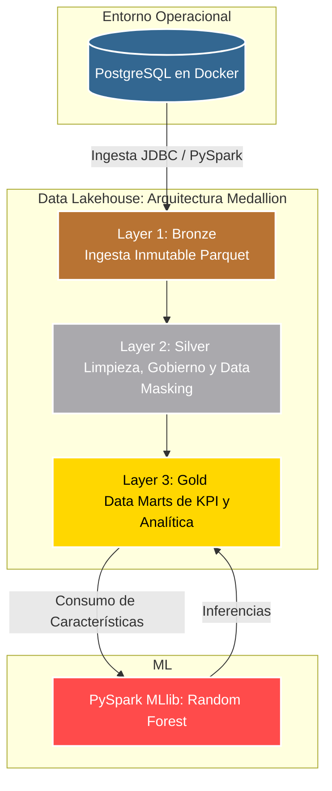

# Ecosistema End-to-End: Data Lakehouse & Machine Learning para Plataforma Fintech

## Resumen Ejecutivo

Ecosistema Fintech End-to-End: Arquitectura Lakehouse diseñada para la ingesta, anonimización, procesamiento masivo y analítica predictiva de datos financieros simulando entornos reales

Descripción de la Problemática a resolver: Se tiene la necesidad de una plataforma para gestionar cuentas digitales, tarjetas y préstamos. Es necesario poder llevar acabo eficientemente las transacciones y la gestión de la información perteneciente a los clientes. 

Este proyecto representa el escalamiento y evolución de una plataforma Fintech transaccional (OLTP) hacia un ecosistema analítico híbrido de datos. Se diseñó e implementó un **Data Lakehouse local** bajo la **Arquitectura Medallion**, acoplando la ingesta automatizada de datos, gobierno de datos financiero, procesamiento distribuido y un modelo predictivo de Machine Learning para la asignación inteligente de líneas de crédito.




### Pilares Fundamentales del Diseño:
1. **Procesamiento con Spark:** Sustitución de queries relacionales tradicionales por transformaciones optimizadas distribuidas en **PySpark** sobre archivos de formato columnar **Apache Parquet**.
2. Diseño de Arquitectura: Diseñé e implementé un Data Lakehouse local bajo la arquitectura Medallion utilizando Docker y PostgreSQL como entorno OLTP transaccional, escalándolo hacia un entorno analítico distribuido.
3. **Gobierno y Seguridad Financiera (Data Masking):** Mitigación de riesgos de ciberseguridad mediante la anonimización automática de Información Personal Identificable (PII) en la capa Silver. Los correos electrónicos se cifran parcialmente (`xxxxxx@email.com`) y los teléfonos se transforman en máscaras (`XXXXXX`).
4. **Orquestación Centralizada:** Automatización unificada a través de `main.py`, el cual levanta los modelos en SQLAlchemy, inyecta los lotes sintéticos en memoria (evitando latencia de red) y activa secuencialmente las fases analíticas de Spark.
5. Habilitación de IA y BI: Consolidación en la capa Gold para el entrenamiento de un modelo predictivo (Random Forest con PySpark MLlib) con un AUC.
6. El diseño está optimizado bajo la Forma Normal de Boyce-Codd (BCNF) para evitar anomalías transaccionales, y cuenta con mecanismos de control internos (*Triggers* y *Procediminetos Almacenados*) encargados de la integridad financiera del sistema.

Tecnologías clave: 
* **Lenguaje Principal:** Python 3.13
* **Motor Analítico Distribuido:** Apache Spark 3.x (PySpark)
* **Entorno Operacional (OLTP):** PostgreSQL 15+ alojado en un contenedor Docker.
* **Mapeo Objeto-Relacional (ORM):** SQLAlchemy
* **Driver de Base de Datos:** `psycopg2-binary`
* **Generación de Datos Sintéticos:** `Faker`
* **Machine Learning:** PySpark MLlib (Clasificación e Inferencia distribuida)
* **Almacenamiento Optimizado:** Apache Parquet
* **Gobernanza Local:** Control de Accesos Basado en Roles (RBAC) simulado mediante políticas de permisos del sistema operativo sobre el directorio `storage/`.


-Requerimientos y Restricciones: 

El usuario debe poder registrar datos personales, no puede transferir más saldo del que tiene disponible y debe ser el saldo no negativo.
Un usuario no puede visualizar ni editar información a la que no tiene permiso.
Se debe poder registrar depoósitos, hacer transferencias y retiros.
Cada tarjeta debe estar vinculada a una única cuenta de usuario.

Enlace a la primera versión del proyecto: https://github.com/JoseSanti97/Proyects/tree/main/Proyecto_Fintech

---


---

## 📁 Estructura del Proyecto

```text
Proyecto_Fintech/
│
├── generador/                  
├── scripts_sql/               
├── storage/                
│
├── pipelines/                  
│   ├── lakehouse/
│   │   └── pipeline_lakehouse.py   #Pipeline principal de PySpark
│   ├── etl_traditional/
│   │   ├── ETL_P1.py
│   │   └── ETL_P2.py
│   └── elt_traditional/
│       ├── ELT_P1.py
│       └── ELT_P2.py
│
├── src/                        # Lógica de negocio, analítica y utilidades
│   ├── analytics/
│   │   └── reportes_kpi.py
│   ├── data_quality/
│   │   └── validar_calidad.py
│   ├── machine_learning/
│   │   └── modelo_ml.py
│   └── utils/
│       ├── auditoria_index.py
│       └── backup_data.py
│
├── main.py                     # Coordinador
├── requirements.txt            # Configuración global
└── README.md                   # Documentación 

```

```


```


## Instalación e Instrucciones

1. Inicializar la Base de Datos en Docker
Levanta el contenedor oficial de PostgreSQL configurando las variables de entorno correspondientes a tu configuración:
```text
docker run -d --name bd_fintech -p 5432:5432 -e POSTGRES_USER=tu_usuario -e POSTGRES_DB=fintech_db -e POSTGRES_PASSWORD=tu_password postgres:latest
```
2. Configurar el Entorno Virtual de Python
Crea y activa tu entorno virtual aislado, e instala la suite de librerías del proyecto:

# Crear entorno virtual
```text
python -m venv .venv
```

# Activar en Windows (PowerShell)
```text
.venv\Scripts\Activate.ps1
```
# Activar en Linux / macOS / Git Bash
```text
source .venv/bin/activate
```
# Actualizar gestor e instalar dependencias
```text
pip install --upgrade pip
pip install -r requirements.txt
```
3. Descargar el Conector JDBC 
Spark requiere el driver oficial de Java para conectarse a PostgreSQL. Descárgalo en el directorio raíz:

# Crear la carpeta de drivers
```text
mkdir -p drivers
```
# En Windows (PowerShell)
Invoke-WebRequest -Uri "[https://jdbc.postgresql.org/download/postgresql-42.6.0.jar](https://jdbc.postgresql.org/download/postgresql-42.6.0.jar)" -OutFile "drivers/postgresql-42.6.0.jar"

# En Linux / macOS
curl -o drivers/postgresql-42.6.0.jar [https://jdbc.postgresql.org/download/postgresql-42.6.0.jar](https://jdbc.postgresql.org/download/postgresql-42.6.0.jar)

4. Ejecución del Flujo de Datos Completo
Ejecuta el pipeline unificado. Este purgará estados anteriores, compilará el esquema relacional DDL, inyectará datos sintéticos e iniciará las fases del Data Lakehouse y Machine Learning de Spark de manera secuencial:
```text
python main.py
```

Módulos Auxiliares y Explotación de Datos
Una vez que el orquestador finalice con éxito, puedes auditar, leer y exportar la información del Lakehouse mediante la consola:

A. Inspección Dinámica de Archivos Parquet
Puedes leer cualquier tabla analítica de las capas Silver o Gold pasando la capa y el nombre como argumentos en la terminal:

# Inspeccionar dimensiones de clientes anonimizados en Silver
```text
python read_parquet.py silver dim_clientes
```
# Inspeccionar el Data Mart consolidado de préstamos en Gold
```text
python read_parquet.py gold kpi_prestamos
```
# Inspeccionar las predicciones financieras
```text
python read_parquet.py gold ml_credit_score
```
B. Exportación de Resultados a Formato CSV
Para análisis en herramientas externas como MS Excel, convierte cualquier tabla Parquet a un archivo .csv plano y unificado:
```text
python parquet_to_csv.py gold ml_credit_score
```
C. Scripts de Calidad y Auditoría (OLTP):
```text
python validar_calidad.py  # Control de calidad y consistencia lógica de saldos
python auditoria_index.py  # Análisis de eficiencia de índices en PostgreSQL
python backup_data.py      # Generación automática de respaldos lógicos (.sql)
```


##  Modelos de la Base de Datos
<details>

  <summary>Haz clic aquí para ver el Modelo Entidad-Relación (E-R)</summary>
  <br>
  <p align="center">
    
  </p>
</details>

<details>
  <summary>Haz clic aquí para ver el Modelo Relacional</summary>
  <br>
  <p align="center">
    
  </p>
</details>

---


## Normalización de la Base de Datos

Normalización del Modelo Relacional

El diseño de la base de datos se estructuró bajo la Forma Normal de Boyce-Codd (BCNF) para erradicar anomalías de inserción, actualización y borrado:

1NF: Se resolvió la presencia de atributos multivaluados creando las entidades atómicas CLIENTE_TEL y BENEFICIARIO_TEL.

2NF & 3NF: Se eliminaron las dependencias parciales y transitivas, aislando los datos del producto financiero en CUENTA y vinculándolos exclusivamente a través del identificador id_cliente como FK.

BCNF: Cada determinante en las tablas principales (como id_cliente y CURP en la tabla CLIENTE) constituye estrictamente una superllave funcional.
